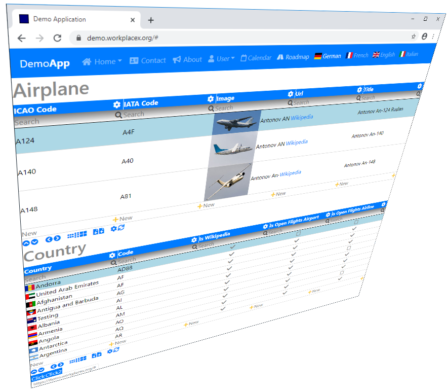

# Application Demo
This is a template to get started with an ASP.NET Core application with Angular 8 client and MS-SQL Server database.

 (ApplicationDemo; github actions;)

[](https://travis-ci.org/WorkplaceX/ApplicationDemo) (ApplicationDemo; travis;)

## Screenshot
This demo shows the capabilities of the WorkplaceX framework. It uses airplanes and a countries stored in the database.


## Getting Started
```cmd
git clone https://github.com/WorkplaceX/ApplicationDemo.git --recursive
cd ApplicationDemo
.\cli.cmd
```

For ConnectionString, deploy sql scripts to database and start the application see: https://workplacex.org/install#git-clone

Or see this "ApplicationDemo" live in action: https://demo.workplacex.org/

## Folder and File Structure
* "Application/" (Application with custom business logic in C#)
* "Application.Cli/" (Command line interface to build and deploy in C#)
* "Application.Cli/DeployDb/" (SQL scripts to deploy to SQL server)
* "Application.Database/" (Generated C# database dto objects like tables and views)
* "Application.Doc/" (Documentation images)
* "Application.Server/" (ASP.NET Core to start application)
* "Application.Website/" (Custom html and css websites used as theme template)
* "Framework/" (External WorkplaceX framework)
* "ConfigCli.json" (Configuration file used by Application.Cli command line interface)
* "ConfigWebServer.json" (Generated configuration used by Application.Server web server)
